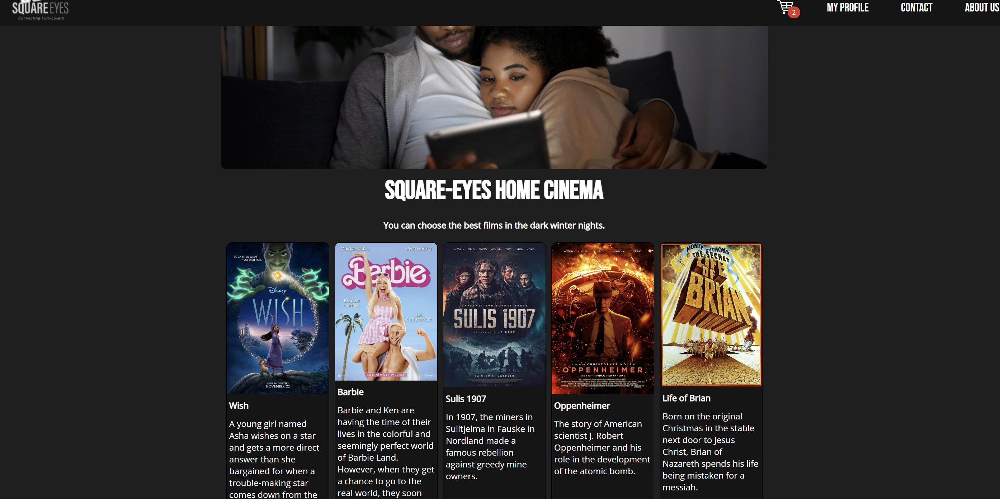

# Square Eyes



This is a video streaming website where one can purchase high-quality videos directly from the people who make them. The users of this website can to purchase videos right away, which will allow them to watch it online.

The website emphasises that you can easily discover great collections or browse through different categories to find films.

## Description

The project is a static website that uses HTML, CSS and JavaScript. The data is stored in a WordPress site, and the website uses the WordPress REST API to fetch the data and display it to the user. Each movie is a separate product in the WordPress WooCommerce plugin.

### [Home Page](./index.html)

The home page show the latest 5 films, and the user can click on the "Show all movies" button to view all products on a separate page. The films are displayed in a grid layout, and the user can click on a film to view it.

### [Movies Page](./movies.html)

The movies page displays a list of all products fetched from the API, and the user should be able to click on a product to view its details on a separate product detail page.
I have made a filter and sort functionality on the page. The user can filter the films by category and sort them by price.

### [Details Page](./details-new.html)

The content of the film specific page dynamically built using a query string parameter based on whatever link the user clicked. The title of the film specific page changes based on the product that has been clicked on. The following information is fetched from the API and displayed on the page:

- Title of the film
- Description
- Price (discounted price if there is a discount)
- Category
- Poster image
- Genre
- Tags
- Rating
- Release year

### [Contact page](./contact.html)

The contact page is only consists of a email address, phone number and a map.

### [About page](./about.html)

The page contains information about the company and the team.

## Built With

The following technologies were used in this project:

- HTML
- CSS
- JavaScript
- [Wordpress](https://wordpress.com/)
- [Netlify](https://www.netlify.com/)
- [Flywheel](https://getflywheel.com/)
- [Woocommerce](https://woocommerce.com/)

## Getting Started

### Installing

This project is a static website, so you can simply download the files and open the `index.html` file in your browser to view the website.

Clone the repo with the following command:

```bash
git clone git@github.com:hajnalkafenyo/square-eyes-web.git
```

### Running

To run the project, simply open the `index.html` file in your browser.

### WordPress

You can use the existing Wordpess installation configured in the JavaScript files.

To use a new WordPress site as the backend for the project, you will need to install the WordPress site on a server. You can use a service like Flywheel to host the site, or you can use a local server like Local by Flywheel.

You need to install the WooCommerce plugin and add products to the site.

## Contributing

Contributions are welcome! Please make a fork of the repo, make your changes and create a Pull Request. I will review the PR and merge it if it looks good.

- For CSS classes and IDs, I use the BEM naming convention, so please follow this convention when adding new styles.

## Contact

Contact me on the following social media platforms:

[LinkedIn](https://www.linkedin.com/in/hajnalka-zsobr%C3%A1kn%C3%A9-feny%C5%91-aab810130/)

## Acknowledgments

This project was made as a part of the Noroff Frontend Development course.
Thanks to my friends who tested the website and gave me feedback.
